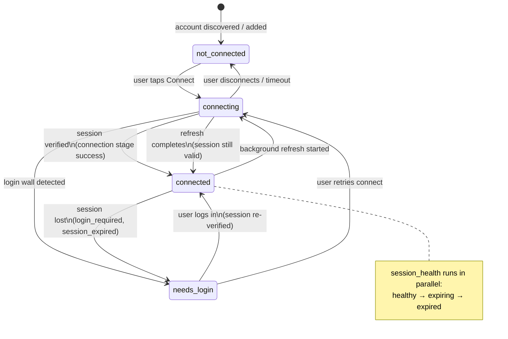
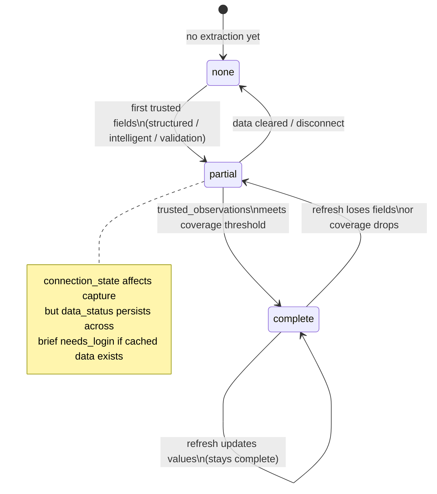
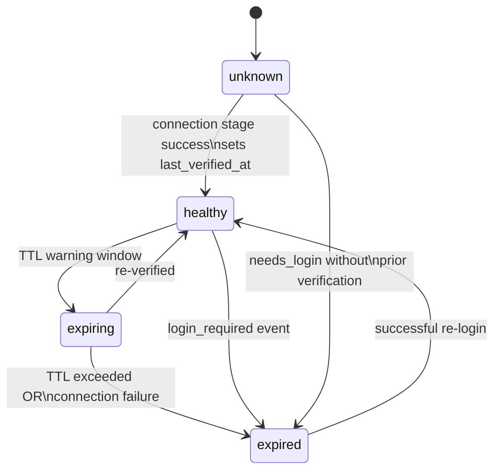
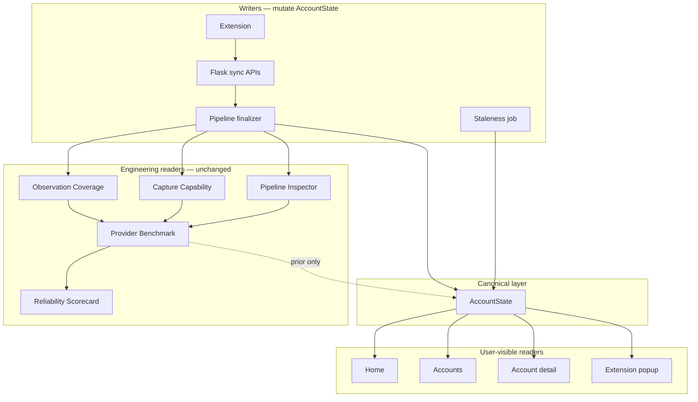

# AccountState — Canonical Account Model

**Status:** Design proposal (no implementation)  
**Date:** July 2026  
**Related:** [PRODUCT_ARCHITECTURE.md](PRODUCT_ARCHITECTURE.md) · [PRODUCT_MANIFESTO.md](PRODUCT_MANIFESTO.md)

---

## Executive summary

Mighty today exposes implementation details to users and engineers alike: extension sync, pipeline runs, trusted observations, capture capability, connection FSMs, and multiple overlapping status models (`ProviderAccount`, `AccountLifecycle`, `AccountStatus`, Amex-only `connection_status`).

This proposal introduces **AccountState** as the single canonical object for every connected account. Users see one Account; engineering diagnostics remain behind it.

**Design principle:** The user owns an *Account* (Amex, Delta, Chase). Mighty owns the machinery that keeps it current. AccountState is the contract between those two worlds.

---

## Part I — AccountState schema

### 1.1 Core object

```python
@dataclass
class AccountState:
    """Canonical per-user, per-provider account state."""

    # ── Identity ──────────────────────────────────────────────────────────
    user_id: str
    provider: str                          # source key: "amex", "delta", …
    display_name: str
    category: str | None                   # travel_loyalty, credit_card, …

    # ── Connection ────────────────────────────────────────────────────────
    access_method: AccessMethod
    connection_state: ConnectionState
    session_health: SessionHealth
    last_verified_at: str | None           # ISO-8601 UTC

    # ── Data ──────────────────────────────────────────────────────────────
    data_status: DataStatus
    last_data_refresh: str | None          # ISO-8601 UTC
    observations_available: list[str]      # user-facing observation type ids
    field_count: int                        # count of meaningful normalized fields

    # ── Guidance ────────────────────────────────────────────────────────────
    next_recommended_action: RecommendedAction | None
    confidence: Confidence

    # ── Presentation (derived, not persisted independently) ───────────────
    status_line: str                        # e.g. "Up to date · Updated today"
    is_actionable: bool

    # ── Metadata ──────────────────────────────────────────────────────────
    updated_at: str                         # ISO-8601 UTC — last AccountState recompute
    version: int                            # schema version for migrations
```

### 1.2 Enumerations

#### `AccessMethod`

How Mighty reaches this provider for this user.

| Value | Meaning | Today maps from |
|-------|---------|-----------------|
| `browser_session` | Chrome extension observes an active provider session | `data_source=extension`, extension sync / intercept |
| `mighty_login` | User credentials stored; Mighty-initiated login (future: Railway) | `data_source=railway`, credential-backed flows |
| `api` | Direct provider or aggregator API | `data_source=api` (future) |
| `manual` | User-entered or email-derived, no live session | `data_source=manual`, `data_source=email` |

**Rule:** `access_method` describes the *primary* path for this account. Secondary writes (e.g. intercept after extension sync) do not change it unless the primary path changes.

#### `ConnectionState`

Whether Mighty can reach the provider on behalf of the user.

| Value | User meaning | Today maps from |
|-------|--------------|-----------------|
| `not_connected` | Account registered or discovered but never linked | `AccountLifecycle`: `discovered`, `added` |
| `connecting` | User started connect or sync in progress | `connection_status`: `connecting`; `AccountStatus`: `updating`; lifecycle `waiting_for_extension` |
| `connected` | Session verified; Mighty can read the provider | `connection_status`: `connected`; lifecycle `connected`, `synced` with healthy session |
| `needs_login` | Provider requires re-authentication | `connection_status`: `needs_login`; `sync_status`: `login_required`; `AccountStatus`: `needs_login` |

**Note:** `not_connected` replaces the distinction between "discovered from Gmail" and "added manually" in user-facing surfaces. Provenance moves to enrollment metadata (Accounts setup only).

#### `SessionHealth`

Freshness of the verified browser/API session — **new concept** (no `session_health` field exists today).

| Value | Meaning | Derivation |
|-------|---------|------------|
| `healthy` | Session verified recently; no login signals | `last_verified_at` within provider TTL; latest connection stage success |
| `expiring` | Session likely stale soon | `last_verified_at` approaching TTL (provider-specific, default 7d warning) |
| `expired` | Session lost or login wall detected | Connection stage `login_required` / `session_expired`; `needs_login` transition |
| `unknown` | Never verified or insufficient signal | No successful connection stage; manual/email accounts |

**Provider TTL defaults (engineering config, not user-visible):**

| Provider class | Healthy window | Expiring window |
|----------------|----------------|-----------------|
| Financial (Amex, Chase, …) | 24h verified | 7d without re-verify |
| Loyalty (Delta, Marriott, …) | 7d verified | 14d without re-verify |
| Manual / email | N/A | always `unknown` |

#### `DataStatus`

Whether Mighty has usable account data — replaces `extraction_status`, `is_synced`, and partial sync concepts.

| Value | User meaning | Today maps from |
|-------|--------------|-----------------|
| `none` | No meaningful fields yet | `extraction_status`: `not_started`; empty `items[]` |
| `partial` | Some fields; gaps remain | `extraction_status`: `pending`; partial trusted observations; `sync_status`: `no_data` with some items |
| `complete` | Core account facts present | `is_synced=True`; trusted_observations covers expected set for user account |

**`complete` threshold:** At least one meaningful normalized field **and** observation coverage ≥ provider minimum (default 60% of category expected set for the user's own latest run). Engineering can tune per provider.

#### `Confidence`

How much Mighty trusts the current account picture.

```python
@dataclass
class Confidence:
    level: Literal["high", "medium", "low"]   # user-facing bucket
    score: int                                 # 0–100, internal + admin
    factors: ConfidenceFactors                 # admin-only breakdown
```

| Level | Score | User copy |
|-------|-------|-----------|
| `high` | 80–100 | (no badge — silence is confidence) |
| `medium` | 50–79 | "Some details may be outdated" (Account detail only) |
| `low` | 0–49 | "We're still learning this account" or "Data may be incomplete" |

**Score formula (weighted):**

| Factor | Weight | Source |
|--------|--------|--------|
| Session freshness | 25% | `session_health` |
| Observation coverage (this account) | 35% | User's latest `trusted_observations` stage |
| Validation pass rate | 25% | Latest validation stage artifacts |
| Provider readiness prior | 15% | Provider Benchmark `readiness_score` (cap influence) |

#### `RecommendedAction`

Single prioritized CTA — replaces scattered lifecycle CTAs, `AccountStatus.user_action_*`, and Home hero selection input.

```python
@dataclass
class RecommendedAction:
    kind: ActionKind
    label: str
    url: str | None
    urgency: Literal["blocker", "soon", "optional"]
    reason: str | None          # admin/debug only
```

| `ActionKind` | When |
|--------------|------|
| `connect` | `not_connected` → enroll |
| `open_provider` | `connecting` / first visit |
| `login` | `needs_login` |
| `wait` | Sync in progress — no user action |
| `none` | Healthy account — silent |
| `review` | Low confidence partial data — optional Account detail visit |

### 1.3 Persistence model

AccountState is **materialized**, not computed on every read.

| Store | Role |
|-------|------|
| `account_state` table (new) | Indexed columns for UI queries: `connection_state`, `data_status`, `session_health`, `confidence_score`, `last_data_refresh`, `updated_at` |
| Encrypted blob (extends `account_data.data_enc`) | Full `AccountState` JSON + normalized `items[]` |
| `account_state_events` table (new, optional) | Append-only audit of transitions for History + debugging |

**Recompute triggers:**

- Any pipeline stage finalization for `(user_id, provider)`
- Extension connection events (`/api/extension/*/connected`, `needs-login`)
- Sync save (`/api/data/sync`)
- Credential enroll / disconnect
- Scheduled staleness job (session TTL expiry)

**Read path:** Dashboard, extension popup, Home, Accounts, and `/api/account-status` read **AccountState only**. No more merging lifecycle + status + provider account at read time.

### 1.4 Relationship to normalized fields

AccountState **references** but does not duplicate field payloads:

```
AccountState
    ├── observations_available[]     ← ids from observation catalog
    ├── field_count                  ← derived from items[]
    └── (items[] lives in encrypted blob, unchanged)
```

Account detail still renders `items[]`; AccountState tells the UI *whether* to show them confidently.

---

## Part II — State transition diagram

AccountState has two largely independent axes — **connection** and **data** — that compose the user-visible picture.

### 2.1 Connection axis



### 2.2 Data axis



### 2.3 Session health (parallel overlay)



### 2.4 Composed user-visible states

The UI maps the tuple `(connection_state, data_status, session_health, next_recommended_action)` to copy — **not** to seven separate enums on screen.

| connection_state | data_status | session_health | status_line (example) |
|------------------|-------------|----------------|------------------------|
| `not_connected` | `none` | `unknown` | "Not connected" |
| `connecting` | `none` | `unknown` | "Connecting…" |
| `connected` | `none` | `healthy` | "Connected · Waiting for first data" |
| `connected` | `partial` | `healthy` | "Partial · Updated today" |
| `connected` | `complete` | `healthy` | "Up to date · Updated today" |
| `needs_login` | `complete` | `expired` | "Needs login · Data from Jun 28" |
| `connected` | `complete` | `expiring` | "Up to date · Session expiring soon" |

This replaces today's `AccountStatus` (`up_to_date`, `updating`, `needs_login`, `waiting_for_extension`, `error`) and `AccountLifecycle` six-state model with one derived presentation layer.

---

## Part III — Subsystem mapping

### 3.1 Overview



### 3.2 Extension → AccountState

**Today:** Extension posts pipeline stages, sync payloads, and Amex-specific connection events. UI merges `AccountStatus` + `AccountLifecycle` + `ProviderAccount`.

**Future:** Extension becomes a **writer**; it never reads composite status models.

| Extension behavior | AccountState fields updated |
|--------------------|----------------------------|
| `/api/sync/start` + progress | `connection_state=connecting`, `next_recommended_action=wait` |
| Connection stage: `session_verified=true` | `connection_state=connected`, `session_health=healthy`, `last_verified_at=now` |
| Connection stage: `login_required` | `connection_state=needs_login`, `session_health=expired` |
| `/api/data/sync` save | Triggers pipeline → see §3.3 |
| `/api/sync/failure` | `next_recommended_action` from failure class; may set `data_status=partial` if prior data |
| Passive login-page detection | `connection_state=needs_login`, `session_health=expired` |

**Extension popup reads:** `GET /api/account-state` (replaces `/api/account-status`).

**Hidden from extension popup:** pipeline run ids, stage artifacts, capture capability rows, benchmark scores.

### 3.3 Pipeline Inspector → AccountState

Pipeline stages remain the **execution trace**. A new `finalize_account_state(run_id)` step projects the latest successful/failed stages into AccountState.

| Stage | AccountState fields | Logic |
|-------|---------------------|-------|
| **connection** | `connection_state`, `session_health`, `last_verified_at`, `access_method` | Success + `session_verified` → `connected`/`healthy`. Failure reasons map: `login_required` → `needs_login`/`expired`; `needs_first_visit` → `connecting` |
| **navigation** | (none direct) | Failures inform `confidence` and engineering diagnostics only |
| **capture** | `confidence` (indirect) | Success required for data path; failure with `no_data` blocks data promotion |
| **structured** | `data_status` | First meaningful normalized fields → `partial` |
| **intelligent** | `data_status`, `observations_available` (candidate) | Discovered fields before validation |
| **validation** | `confidence.score`, `confidence.factors` | Pass/fail ratios, filtered field counts |
| **trusted_observations** | `data_status`, `observations_available`, `last_data_refresh`, `field_count` | `trusted_keys[]` → observation ids; coverage vs expected → `partial` vs `complete`; `finished_at` → `last_data_refresh` |

**Run terminal state:**

| `run_status` | AccountState effect |
|--------------|---------------------|
| `complete` | Full projection from terminal stage |
| `failed` | Update connection/confidence; preserve prior `data_status` if cached data exists |
| `aborted` | No AccountState change (except `connecting` → rollback) |

**Pipeline Inspector admin UI:** Unchanged. Still shows run list, stage timeline, artifacts, failure reasons. It reads `pipeline_runs` / `pipeline_stages`, not AccountState.

### 3.4 Capture Capability → AccountState

**Today:** Provider-level admin view comparing needed vs present evidence types (`visible_text`, `network_json`, …) from pipeline stages.

**Future role:**

| Scope | Relationship to AccountState |
|-------|------------------------------|
| Per-provider (admin) | **Unchanged** — engineering inventory |
| Per-account (user) | **Not exposed** — feeds `confidence.score` only |

**Projection rule:**

```
capture_ratio = present_capabilities / needed_capabilities  # from latest run
confidence.capture_factor = capture_ratio × 100
```

If capture stage failed (`no_data`, `login_wall`), set `confidence.level=low` regardless of ratio.

**Hidden:** Capability IDs, evidence marker counts, raw_text block types, `IMPROVEMENT_BY_CAPABILITY` strings.

**User-visible (only when low confidence):** "We couldn't read everything on your last visit" — no mention of "network JSON" or "embedded state."

### 3.5 Observation Coverage → AccountState

**Today:** Provider-level aggregate across all pipeline runs in a time window.

**Future:**

| Field | Source |
|-------|--------|
| `observations_available` | User's **latest successful** `trusted_observations` stage for `(user_id, provider)` — not global aggregate |
| `data_status=complete` | User observation coverage ≥ provider minimum |
| `confidence.observation_factor` | User coverage % |

**Admin Observation Coverage UI:** Unchanged — still shows provider-level expected vs observed across all runs (for engineering prioritization).

**User-visible:**

- Account detail: list of known facts (from `items[]`), not observation type ids
- Optional Account detail footer when `data_status=partial`: "Mighty is still learning: payment due date, tier status" — mapped from `missing` observation **labels**, not ids

**Hidden:** `observation_catalog` ids, `expected[]` arrays, cross-user aggregates, coverage percentages (unless low confidence warrants soft messaging).

### 3.6 Provider Benchmark → AccountState

**Today:** Provider-level readiness score combining login, capture, observation, and recommendation subscores across 14-day pipeline window.

**Future:**

| Scope | Role |
|-------|------|
| Admin benchmark | **Unchanged** — provider prioritization |
| AccountState | **Prior only** — 15% weight in `confidence.score` |

**Not user-visible:** `login_score`, `capture_score`, `readiness_score`, `trend_delta`.

**Indirect user effect:** A provider with low readiness may cause `confidence.level=medium` even when the user's own session is healthy — honest "we're still improving Amex support" copy at low prior threshold.

### 3.7 Provider Reliability Scorecard → AccountState

**Today:** Rollup of benchmark + top failure reasons + missing observations + `needs_attention` ranking.

**Future:** **No direct AccountState fields.** Scorecard remains admin-only.

**Indirect links:**

| Scorecard output | AccountState influence |
|------------------|------------------------|
| `top_login_failure_reasons` | Informs engineering; `needs_login` user copy stays generic |
| `most_missing_observations` | Drives provider roadmap; optional partial-data messaging |
| `needs_attention` | Admin queue — does not surface to users |

---

## Part IV — Engineering diagnostics (remain hidden)

These concepts **stay in the engineering layer**. They write pipeline stages and inform AccountState projection but never appear in user surfaces.

| Diagnostic | Location today | Stays hidden |
|------------|------------------|--------------|
| Pipeline run id / initiator | `pipeline_runs` | ✓ |
| Stage timeline (connection → trusted_observations) | Pipeline Inspector | ✓ |
| Stage artifacts (`raw_text_chars`, `json_payload_chars`, `urls[]`, `trusted_keys[]`) | `pipeline_stages.artifacts_json` | ✓ |
| Failure reason codes (`connector_miss`, `llm_empty`, `quality_gate`, …) | `pipeline_stages.failure_reason` | ✓ |
| Capture capability inventory | Capture Capability admin | ✓ |
| Evidence markers (`=== API RESPONSE:`, `=== EMBEDDED STATE:`) | `raw_text` | ✓ |
| Inferred vs extension-measured stages | `inferred` flag on stages | ✓ |
| Provider benchmark subscores | Provider Benchmark admin | ✓ |
| Reliability scorecard rankings | Scorecard admin | ✓ |
| Recommendation unlock catalog | `recommendation_unlocks` | ✓ |
| Field discovery / LLM traces | `field_discovery`, AI observability | ✓ |
| Network intelligence markers | `network_intelligence` | ✓ |
| Site URL health (HTTP checks) | `site_url_health` | ✓ |
| Sync session flags | `users.sync_running`, `sync_current_source` | ✓ (UI shows "Updating…" via AccountState) |
| `extraction_status` enum | `provider_account` | ✓ (replaced by `data_status`) |
| Amex connection FSM internals | `connection_state.py` | ✓ (replaced by `connection_state`) |
| `sync_status` column values | `account_data` | ✓ ( absorbed into AccountState ) |
| Confidence factor breakdown | `Confidence.factors` | ✓ (admin only) |

**Admin surfaces preserved:** `/admin/pipeline-runs`, `/admin/capture-capability`, `/admin/coverage`, `/admin/provider-benchmark`, `/admin/provider-reliability-scorecard` — all continue to read pipeline tables directly.

---

## Part V — User-visible information

### 5.1 Surfaces and fields

| Surface | AccountState fields shown | Copy style |
|---------|---------------------------|------------|
| **Home** health strip | Counts by `connection_state`, `data_status` | "12 accounts · 2 need login" |
| **Home** hero | `next_recommended_action` (highest urgency account) | "Amex needs login" + CTA |
| **Accounts** list row | `display_name`, `status_line`, `last_data_refresh` | One line per account |
| **Accounts** filters | `connection_state`, `data_status` | All · Up to date · Waiting · Needs login |
| **Account detail** header | `status_line`, `confidence` (if not high) | "Up to date · Updated today" |
| **Account detail** body | `items[]` (unchanged) | Field values |
| **Account detail** gaps | Derived from partial `observations_available` | "Still learning: …" |
| **Extension popup** | `next_recommended_action`, summary counts | ≤3 second glance |
| **Push / notifications** | `next_recommended_action` when `urgency=blocker` | Login, expiring value |

### 5.2 API contract (proposed)

```
GET  /api/account-state              → AccountState[] + summary
GET  /api/account-state/:provider    → AccountState + items[] (detail)
POST /api/account-state/:provider/connect   → enrollment (writes connecting)
```

Replaces: `/api/account-status`, scattered lifecycle endpoints for UI reads.

**Extension and dashboard share one payload shape** — eliminates today's drift between `AccountStatus` and `AccountLifecycle`.

### 5.3 What users never see

- "Pipeline", "stage", "trusted observations", "capture capability"
- "Extension sync", "Railway", "intercept", "LLM discovery"
- Readiness scores, benchmark percentages, trend deltas
- Failure reason codes
- `access_method` enum value (UI shows "Updates when you visit Amex in Chrome" in Settings/Accounts explainer, not on every card)

### 5.4 Mapping from today's user-visible model

| Today | AccountState |
|-------|--------------|
| `AccountStatus.up_to_date` | `connected` + `complete` + `healthy` |
| `AccountStatus.updating` | `connecting` + any `data_status` |
| `AccountStatus.needs_login` | `needs_login` |
| `AccountStatus.waiting_for_extension` | `connecting` or `not_connected` |
| `AccountStatus.error` | `connected` + `partial`/`none` + low confidence OR failed non-login sync |
| `AccountLifecycle.discovered/added` | `not_connected` |
| `AccountLifecycle.connected` | `connected` + `none` |
| `AccountLifecycle.synced` | `connected` + `complete`/`partial` |
| `user_action_label/url` | `next_recommended_action` |

---

## Part VI — Migration and implementation notes

*Design only — not implemented.*

### 6.1 Phased rollout

| Phase | Scope |
|-------|-------|
| **P0** | Introduce `AccountState` dataclass + projector from existing models (read-only shadow mode) |
| **P1** | `/api/account-state` behind flag; compare with `/api/account-status` |
| **P2** | Dashboard + extension read AccountState |
| **P3** | Pipeline finalizer writes AccountState; deprecate dual-write to `connection_status` / lifecycle |
| **P4** | Remove `AccountStatus`, `AccountLifecycle` from UI read paths |

### 6.2 Backward compatibility

- `ProviderAccount`, `pipeline_runs`, `pipeline_stages` **remain** — AccountState is a projection layer, not a replacement for execution storage.
- Amex `connection_state.py` FSM becomes an internal writer to `connection_state` until all providers use unified transitions.
- Encrypted `items[]` / `raw_text` blob format unchanged.

### 6.3 Open questions

1. **Per-account vs per-provider confidence prior:** Should a user's Amex confidence incorporate global Amex benchmark, or only their own runs?
2. **`complete` threshold:** Fixed 60% observation coverage vs category-specific minimums?
3. **Historical AccountState:** Do we expose "Data from Jun 28" after `needs_login`, or hide stale data entirely?
4. **`access_method` for email/manual:** Keep as `manual` or introduce `email_discovery`?
5. **Multi-account per provider:** Future schema may need `account_id` distinct from `provider` (e.g. two Amex cards) — out of scope for v1.

---

## Part VII — Summary

| Deliverable | Location in this doc |
|-------------|------------------------|
| AccountState schema | Part I |
| State-transition diagrams | Part II |
| Pipeline stage → AccountState mapping | §3.3 |
| Subsystem mapping (Extension, Capture, Coverage, Benchmark, Scorecard) | Part III |
| Hidden engineering diagnostics | Part IV |
| User-visible information | Part V |

**One sentence for the team:** AccountState is the user-facing truth; pipeline stages are the engineering truth; the projector connects them — and users never need to know the difference.
