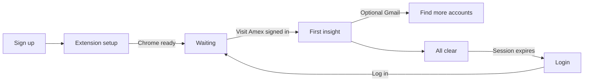

# Home Experience

Product design for Mighty Home — written for a **first-time user** who has never seen the product before.

**North star:** Home answers one question in five seconds: *Does anything need me?*

**Emotional target:** When all is well, Home feels like checking the weather on a clear day — brief confirmation, then done. When something matters, it feels like one well-prioritized notification, not a control panel full of competing CTAs.

**Related:** [PRODUCT_MANIFESTO.md](PRODUCT_MANIFESTO.md)

---

## What Mighty is (first glance)

Before any account exists, Home must teach the product in one breath:

> **Mighty watches the accounts you already have** — from your email and from normal browsing in Chrome — **and tells you when something is worth your time.** Login is the only thing you do manually.

Home is an **attention inbox**, not a spreadsheet. Balances, perks, and history live in account detail views. Home curates what needs you today.

---

## Page anatomy (all states)

Every Home state shares the same skeleton. Only the **hero** (Daily Brief) and **featured block** change weight.

| Region | Role | First-time user sees |
|--------|------|----------------------|
| **Daily Brief** | Greeting + today's summary + one featured priority | Always present; content adapts to state |
| **Featured action** | Single highest-priority item | One card only — never a grid of equal CTAs |
| **Account health** | Compact status of tracked accounts | Counts by status; tap opens Accounts filtered to that status |
| **Recommendations** | Optional savings / cross-program opportunities | Only when real recommendations exist |
| **Footer strip** | Quiet reassurance | "Mighty runs in Chrome · Last checked [time]" |

**Global rule:** Exactly **one primary CTA** per state. It lives in the Daily Brief featured block. Secondary CTAs are text links or low-emphasis buttons — never a second filled button competing for attention.

---

## Attention vs enrollment on Home

**Attention interrupts** (login blockers, agent authorization, silence) are owned by the Attention Platform: `AttentionState` → `AttentionView`. Home **renders** that view; it does not re-rank.

**Enrollment / operational context** (empty portfolio, waiting for first data, update-in-progress) may still be prepared by `resolve_home_state` for capability/Truth presentation. Those are not a second attention ranking table.

See [ATTENTION_PLATFORM_ADOPTION.md](ATTENTION_PLATFORM_ADOPTION.md) and [ATTENTION_VIEW.md](ATTENTION_VIEW.md).

### Historical six-state model (superseded for attention)

The former Home-local priority (Login → Empty → Waiting → Update → Recommendation → All clear) is **removed** as attention policy. Login/recommendation interrupts must come from AttentionView.

---

## State 1 — Empty

**When:** Signed up, no Gmail scan yet, zero enrolled accounts, worker may or may not be installed.

### Purpose

Orient a stranger. Explain what Mighty does, why Chrome matters, and the one step that unlocks everything — without a checklist of two hundred "Add account" clicks.

### What appears

- **Daily Brief** — product explanation, not fake data
- **Account health** — hidden (nothing to report)
- **Recommendations** — hidden
- **First-visit modal** (once) — privacy + "How Mighty works" in plain language; dismissible

### Headline

**"Your accounts, watched quietly."**

### Body copy

Mighty finds airlines, hotels, and card programs from your Gmail and keeps them current while you browse in Chrome. You sign in when asked — Mighty handles the rest.

Use **desktop Chrome** with Mighty added. Home shows results; it never logs into provider sites for you.

### Primary CTA

**Add Mighty to Chrome**

### Secondary CTA

Add an account manually → (Accounts)

### Things intentionally NOT shown

- Demo balances, fake Marriott certs, or placeholder dollar totals
- Account card grid duplicating Accounts
- Sync now, Connect, or per-account action buttons
- Worker setup as a separate scary step (mention Chrome inline; deep-link to setup only if worker missing after Gmail)
- Engagement nudges ("Complete your profile," streaks, upsells)

### Transition into next state

| Event | Next state |
|-------|------------|
| Gmail scan completes; accounts auto-enrolled | **Waiting** |
| User adds one account manually without Gmail | **Waiting** |
| Worker not detected after Gmail | **Waiting** (with worker sub-message in body) |
| User dismisses without connecting | Stays **Empty** until return visit |

---

## State 2 — Waiting

**When:** One or more accounts enrolled (from Gmail or manual add) but Mighty has not yet captured meaningful data — worker pending, first visit not happened, session verified but extraction not started, or extraction pending after login.

### Purpose

Reassure that Mighty is already working. Set expectation: data arrives on your **next normal visit** to a provider while logged in — not from a sync ritual.

### What appears

- **Daily Brief** — calm progress summary
- **Featured action** — single account closest to first data (or worker setup if extension missing)
- **Account health** — e.g. "3 tracking · 0 with data yet · 0 need you"
- **Per-account rows** (in health section only) — provider name + honest status: "Waiting for first visit" or "Connected — awaiting data"
- **Recommendations** — hidden

### Headline

**"Mighty is tracking [N] accounts."**

*(If N = 1, use the provider name: "Mighty is tracking American Express.")*

### Body copy

Visit your account page in Chrome while logged in — that's when the worker captures your balances and perks. Usually takes one visit; no sync button needed.

If the worker isn't installed yet, set it up once and keep browsing normally.

### Primary CTA

**Open [Provider]** — opens the highest-priority waiting account in Chrome (the one Gmail surfaced first, or the only enrolled account)

*(If worker not detected: **Set up worker** → extension setup)*

### Secondary CTA

View all accounts → (Accounts, filtered to "Waiting")

### Things intentionally NOT shown

- Fake points balances or "Demo" tags
- Multiple equal "Open provider" buttons in the hero
- Countdown timers or anxiety-inducing spinners (subtle "Updating…" only in Update overlay)
- Instructions to enter passwords into Mighty
- Bulk "Connect all" checklist

### Transition into next state

| Event | Next state |
|-------|------------|
| User visits provider; extraction starts | **Update** (brief) |
| Session detected but user not logged in | **Login** |
| First meaningful data captured | **All clear** or **Recommendation** (if an expiring perk was found) |
| Extraction fails (timeout, no data) | Stays **Waiting** with honest sub-status on account row; no hero change unless login required |

---

## State 3 — Login

**When:** One or more enrolled accounts have an expired or missing provider session. Mighty cannot proceed until the user signs in **on the provider site in Chrome**.

### Purpose

Surface the **one blocker** that only the user can fix. Login is the only manual step — say so plainly.

### What appears

- **Daily Brief** — names the blocked account(s)
- **Featured action** — single login card for the highest-priority account (urgent expiring value beats stale session)
- **Account health** — e.g. "4 up to date · 1 needs login"
- **Recommendations** — hidden until login resolved (don't tease perks on accounts we can't read)

### Headline

**"[Provider] needs login."**

*(Plural: "**2 accounts need login.**" — featured card still shows only one.)*

### Body copy

Sign in to [Provider] in Chrome — the only manual step. After you log in, keep your account page open for a few seconds so the worker can verify your session.

Mighty never sees or stores your password.

### Primary CTA

**Log in to [Provider]** — opens provider login in Chrome

### Secondary CTA

View all accounts needing login → (Accounts, filtered)

### Things intentionally NOT shown

- Password fields inside Mighty
- "Reconnect" or "Sync now" as primary language
- Shame copy ("You logged out," "Action required!!!")
- All blocked accounts as equal hero cards (secondary list lives in Account health / Accounts)
- Unrelated recommendations or cross-sell

### Transition into next state

| Event | Next state |
|-------|------------|
| User logs in; worker verifies session | **Update** (brief) |
| Session verified; extraction completes | **All clear** or **Recommendation** |
| User ignores; other accounts healthy | **All clear** for healthy accounts with a persistent but quiet login row in Account health *(Login state remains dominant in hero until resolved or snoozed)* |
| Multiple logins needed; one fixed | **Login** (hero advances to next account) |

---

## State 4 — Update

**When:** Transient. Worker is actively verifying a session or extracting data — typically 5–30 seconds after a provider visit or login.

### Purpose

Acknowledge progress without turning Home into a progress dashboard. The user should feel "it's working" and leave.

### What appears

- **Daily Brief** — short in-progress message
- **Featured action** — replaces CTA with non-clickable progress: "Updating [Provider]…"
- **Account health** — account row shows "Updating…" for affected provider only
- **Recommendations** — hidden during update
- **Auto-refresh** — Home reloads quietly when extraction completes (user should not need to refresh)

### Headline

**"Updating [Provider]…"**

*(Plural: "Updating your accounts…" if multiple simultaneous — rare.)*

### Body copy

This usually takes a few seconds. You can leave this tab open or come back — Home will refresh when your data is ready.

### Primary CTA

**None** — progress state is not an action moment. If a button must exist for layout consistency, use a disabled **Updating…** label, not a clickable CTA.

### Secondary CTA

View accounts → (Accounts)

### Things intentionally NOT shown

- Step-by-step extraction logs, worker jargon, or enum names
- Cancel button
- Secondary actions that compete ("Sync again," "Retry" unless update failed)
- Demo or stale data mixed with loading state

### Transition into next state

| Event | Next state |
|-------|------------|
| Extraction succeeds with data | **All clear** or **Recommendation** |
| Extraction succeeds; login still required elsewhere | **Login** |
| Extraction fails (no data, timeout) | **Waiting** with honest account sub-status |
| Extraction fails (logged out) | **Login** |

---

## State 5 — All clear

**When:** All enrolled accounts have fresh data (or honest "not yet visited" is not blocking), no login required, no urgent expiring benefits, no featured recommendation above the noise floor.

### Purpose

Calm confirmation — the weather-on-a-clear-day moment. Reinforce that Mighty already did the work.

### What appears

- **Daily Brief** — positive summary with real metrics from user's data
- **Featured action** — none, or a soft "View [top account]" only if user has exactly one account and might want depth
- **Account health** — e.g. "5 up to date · Updated today"
- **Recommendations** — hidden unless informational recs exist below urgency threshold
- **Footer strip** — "Last checked [relative time]"

### Headline

**"You're all set."**

*(Alternate when data is fresh but narrow: "Everything looks current.")*

### Body copy

Mighty is watching [N] accounts. No expiring perks or logins need you right now. Check back anytime — we'll speak up when something matters.

### Primary CTA

**View accounts** — low-commitment depth path

*(If exactly one account with rich data: **View [Provider]**)*

### Secondary CTA

None required. Optional text link: Activity → (only if user has agent approvals pending — otherwise omit entirely)

### Things intentionally NOT shown

- Empty-state guilt ("Add more accounts!")
- Sync now, refresh rituals, or stale-data warnings for healthy accounts
- Wall of account cards
- Fake urgency
- Notification permission prompts on every visit

### Transition into next state

| Event | Next state |
|-------|------------|
| Session expires | **Login** |
| New account enrolled, no data yet | **Waiting** |
| User visits provider; re-extraction runs | **Update** (brief) → back to **All clear** |
| Expiring credit/perk crosses urgency threshold | **Recommendation** |
| User deletes all accounts | **Empty** |

---

## State 6 — Recommendation

**When:** Mighty surfaced real, actionable value — expiring credit, certificate, benefit deadline, or a high-confidence savings opportunity tied to accounts the user actually has.

### Purpose

Deliver the **magic moment**: one well-prioritized thing worth doing, with enough context to act now and enough restraint not to become a deals feed.

### What appears

- **Daily Brief** — featured recommendation card (headline, why, value badge, urgency)
- **Account health** — unchanged compact strip; may show "1 need attention" chip
- **Recommendations section** — up to 2 secondary opportunities (collapsed on mobile)
- **Featured action** — same as Daily Brief primary (exactly one)

### Headline

**"[Benefit headline]"** — e.g. "Use your $40 dining credit before Friday"

*(Daily Brief greeting still shows: "Good morning, [Name]" + date.)*

### Body copy

[One sentence why it matters — tied to user's real account data.] Surfaced from [Provider] during your latest update.

### Primary CTA

Context-specific — e.g. **View Amex offers**, **Book with Marriott**, **Use credit**

*(Must deep-link to the provider or the relevant account detail — never a generic "Learn more.")*

### Secondary CTA

Dismiss for now · Snooze 7 days *(soft text actions, not buttons)*

### Things intentionally NOT shown

- Card product upsells unrelated to connected accounts
- Multiple equal-priority hero cards
- Demo recommendations when real data exists
- Generic "You have 4 things!" without a clear featured winner
- Login-blocked accounts contributing fake recommendation value

### Transition into next state

| Event | Next state |
|-------|------------|
| User completes action or dismisses | **All clear** (if nothing else urgent) |
| Deeper issue discovered (login required to use benefit) | **Login** |
| Second urgent item remains | **Recommendation** (hero advances to next priority) |
| Benefit expires | **All clear** with optional quiet "Expired" note in account detail only — not a scolding Home state |

---

## Account health section

A compact strip below the Daily Brief in every state except **Empty**. Not a grid — a **summary + optional expand**.

### Purpose

Answer "How are my accounts doing?" without duplicating Accounts. Tap a chip to open Accounts pre-filtered.

### Structure

```
Account health
[● N up to date]  [◐ M waiting]  [🔐 K need login]     Updated 2h ago
```

- **Up to date** — fresh extraction, session valid
- **Waiting** — enrolled, no meaningful data yet
- **Need login** — session blocked

### Copy rules

- Use plain language: "Need login," not `login_required` or "Disconnected"
- Show relative freshness: "Updated today," "Updated yesterday," "Not yet updated" — never fake timestamps
- If all accounts are in one bucket, collapse the others (don't show "0 need login")

### First-time user

After first successful extraction, Account health is the proof point: **"1 up to date · Updated just now"** — this confirms the magic moment landed.

### Intentionally NOT shown

- Per-field balances (those live in account detail)
- Sync buttons
- Internal worker status
- Red badges on healthy accounts

---

## Daily Brief

The top of Home — greeting, date, priority summary, and one featured block.

### Purpose

Set emotional tone and answer *Does anything need me?* in one scan.

### Anatomy

1. **Greeting** — "Good morning, [First name]" (time-aware)
2. **Date** — "Friday, July 3"
3. **Priority summary** — one line beneath greeting:
   - Empty: omitted (headline carries the load)
   - Waiting: "Getting your first update."
   - Login: "One thing needs you."
   - Update: "Almost there."
   - All clear: "Nothing urgent today."
   - Recommendation: "1 thing worth your attention." *(or count if secondary items exist)*
4. **Featured block** — the single hero card for the current state
5. **Secondary rows** — max 2, only in **Recommendation** state; never in Empty or Login
6. **Metrics chips** ("Also") — only when real data exists: `[N accounts] · [M benefits tracked] · [$X tracked value]`

### Rules

- **Truthful by default:** Real data or honest waiting copy — never demo content when the user has real accounts
- **One featured action** beats three equal cards
- Depth on demand: tapping a secondary row opens detail, not another hero
- Auto-refresh after Update completes; brief should reflect new data without manual reload

### First-time arc

| Visit | Brief feels like |
|-------|------------------|
| 1 | "Here's what Mighty is" (Empty) |
| 2 | "We're on it" (Waiting) |
| 3 | "Your points are here" (All clear or Recommendation) |

---

## Notification philosophy

Mighty works quietly. Notifications extend Home — they do not replace it or nag for engagement.

### When we notify

| Trigger | Channel | Copy tone |
|---------|---------|-----------|
| Benefit expiring within urgent window (e.g. 7 days) | Push / email | Specific: "$40 dining credit expires Friday" |
| Session lost on account with tracked value | Push / email | "Amex needs login to keep your perks current" |
| First successful extraction (once per account) | In-app only | Quiet toast: "American Express updated" |
| Agent requests approval | Push / in-app | "Your agent wants to [specific action]" → Activity |

### When we do NOT notify

- Background sync succeeded on healthy accounts
- "You haven't opened Mighty in 3 days"
- New recommendations below urgency threshold
- Worker heartbeat, extraction logs, or technical success
- Marketing, feature announcements, or referral prompts (unless user opts in separately)

### Principles

1. **Healthy accounts are silent.** No news is good news.
2. **Urgency = real value at risk** — expiring credits, session loss, failed extraction on an account user cares about — not engagement metrics.
3. **One notification → one action.** Deep-link to the exact account or approval, not generic Home.
4. **Respect dismiss and snooze.** Same item stays quiet until the snooze window passes or state materially changes.
5. **In-app first.** Push is earned after the user has seen value (first successful extraction complete).

### Relation to Home states

- A push may bring the user to Home already in **Login** or **Recommendation** — the hero must match the notification promise, not a generic dashboard.
- Clearing a notification condition transitions Home to **All clear** without requiring the user to "mark read" on Home itself.

---

## First-time user journey (end-to-end)



**Success criteria for onboarding:** User sees real data on Home without clicking Sync, understands Chrome's role, and knows that login is the only manual step.

**Magic moment:** First real balance or perk appears on Home automatically after a normal provider visit — the brief shifts from Waiting to All clear (or Recommendation) without user-initiated refresh.

---

## Design review checklist

Before shipping Home changes, ask:

1. Can a first-time user explain what Mighty is within 5 seconds of this state?
2. Is there exactly one primary CTA?
3. Would a healthy user with 50 synced accounts see this every day? *(If yes, it probably doesn't belong in the hero.)*
4. Is every number and name real — or honestly labeled as waiting?
5. Does the next state transition happen automatically when Mighty completes work — without a sync ritual?

---

## What we do not build on Home

- Per-account Sync now / Connect on the happy path
- Account card grids duplicating Accounts
- Demo or placeholder data when real extraction succeeded
- Engagement empty states punishing healthy users
- Internal lifecycle jargon as primary UI
- Multiple competing primary buttons

See [PRODUCT_MANIFESTO.md](PRODUCT_MANIFESTO.md) for the full anti-pattern list.

---

## Document status

| Input | Status |
|-------|--------|
| PRODUCT_MANIFESTO.md | Used |
| UX_PRINCIPLES.md | Not in repo — principles inlined from manifesto |
| MAGIC_MOMENTS.md | Not in repo — magic moment defined in First-time user journey |

Implementation: [HOME_V1.md](HOME_V1.md) — Home V1A daily executive briefing (pure projection over Attention, enrollment ops, and meaningful changes).
